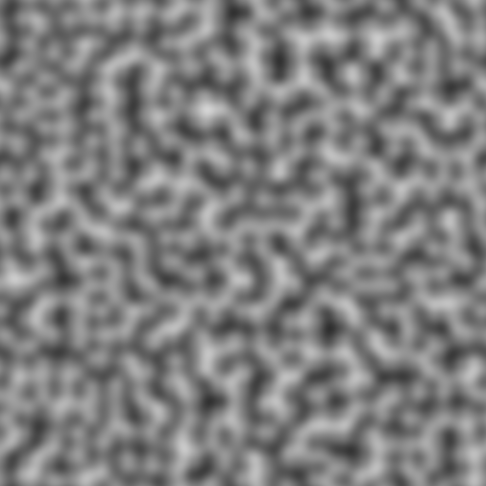
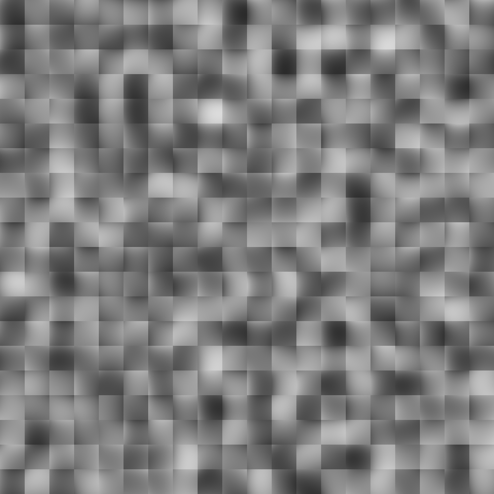
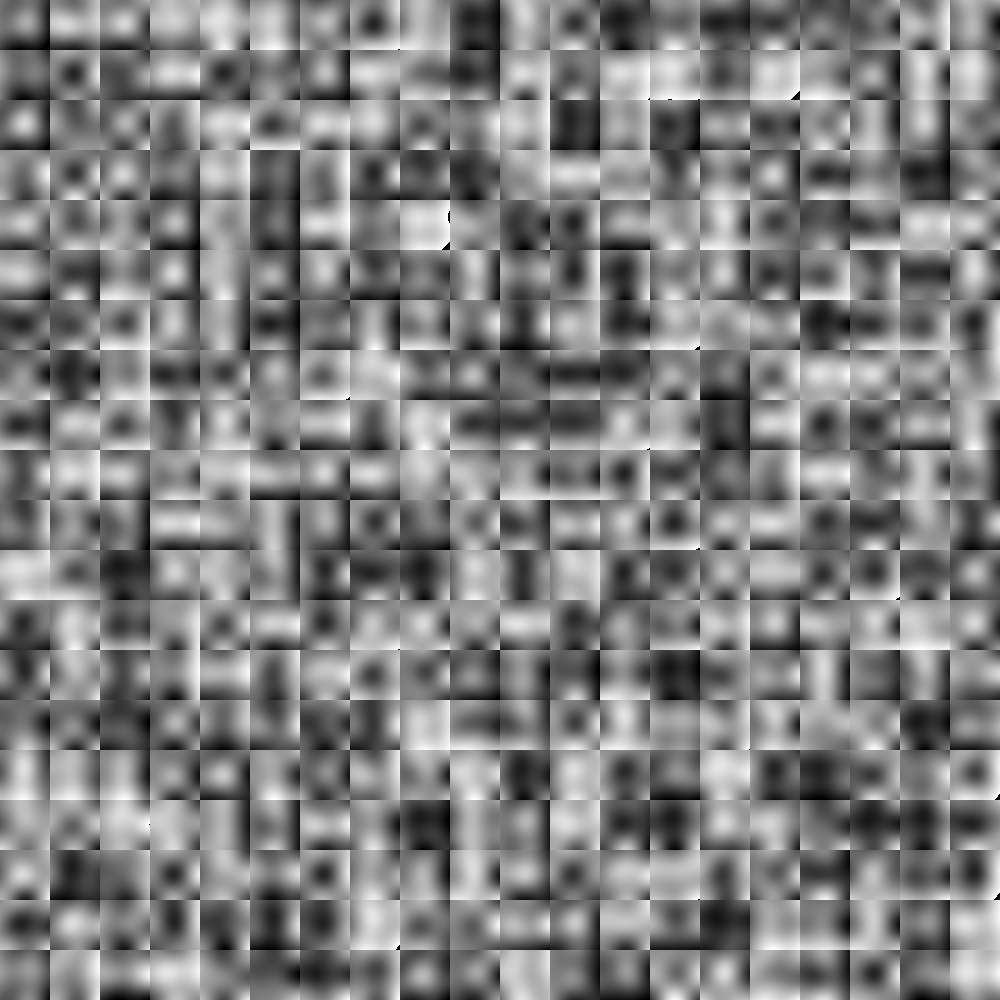

# Perlin Noise Generator

Ich habe das Programm angepasst, dass man es mit `./PerlinNoise <smoothingFunction>` ausführen kann. Es gibt folgende smoothing Funktionen:

- `linear` : $f(d) = d$
- `cubic` : $f(d) = 3d^2 - 2d^3$
- `quintic` : $f(d) = 6d^5 - 15d^4 + 10d^3$
- `cosine` : $f(d) = \frac{1-\cos{\pi d}}{2}$
- `hermite` : $f(d) = d^2(3 - 2d)$
- `exponential` : $f(d) = 1 - e^{-d}$
- `gaussian` : $f(d) = e^{-((d - 0.5)^2) / (2\sigma^2)}$
- `piecewiseQuadratic` :
  $f(d) =\begin{cases}2d^2 & \text{if } d < 0.5 \\ 1 - 2(1-d)^2 & \text{if } d \geq 0.5 \end{cases}$

Es ist auch möglich, das Argument als letztes Argument anzugeben mit allen anderen Argumenten um GridSize Seed etc. anzupassen.

## Meine Beobachtungen

### Variation der Gittergrösse

Eine grosse Gittergrösse führt zu weniger, aber grösseren Bereichen mit einer homogenen Struktur. Insbesondere wirken die Übergänge zwischen den Extremen glatter, auf Kosten der Details. Das Noise-Muster wirkt grober.

Eine kleine Gittergrösse erzeugt mehr Details und bessere Variationen im Noise. Allerdings wirkt das Bild etwas körniger und weniger glatt.

### Verschiedene Interpolationsfunktionen

Die Wahl der Interpolationsmethode hat einen Einfluss auf die 'Weichheit' der Übergänge. Eine lineare Interpolation erzeugt daher sehr harte Übergänge zwischen den Gitterpunkten wobei z.B. die kubische Interpolationsmethode deutlich glattere Übergänge erzeugt, auf Kosten der Performance.

## Generierte Bilder mit verschiedenen Interpolationsfunktionen

Alle Bilder wurden mit Default-Parametern generiert.

### Constant

### Cubic

### Quintic

### Cosine

### Exponential

### Gaussian

### Hermite

### Piecewise Quadratic

