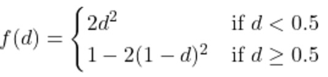

# Perlin Noise Generator

This project implements a Perlin noise generator with support for multiple smoothing (interpolation) functions. The program can be run via:

```bash
./PerlinNoise <smoothingFunction>
```

You can also specify the smoothing function as the last argument, after setting other parameters like grid size or seed.

## Supported Smoothing Functions

The following smoothing functions are available:

* **`linear`**: \$f(d) = d\$
* **`cubic`**: \$f(d) = 3d^2 - 2d^3\$
* **`quintic`**: \$f(d) = 6d^5 - 15d^4 + 10d^3\$
* **`cosine`**: \$f(d) = \frac{1 - \cos{(\pi d)}}{2}\$
* **`hermite`**: \$f(d) = d^2(3 - 2d)\$
* **`exponential`**: \$f(d) = 1 - e^{-d}\$
* **`gaussian`**: \$f(d) = e^{-((d - 0.5)^2) / (2\sigma^2)}\$
* **`piecewiseQuadratic`**: Defined as: 

## Observations

### Grid Size

Changing the grid size affects the structure and detail level of the generated noise:

* **Larger grid sizes** produce smoother transitions and broader homogeneous areas, but reduce detail.
* **Smaller grid sizes** generate finer details and more variation, resulting in a sharper, more "grainy" texture.

### Interpolation Methods

The interpolation function plays a key role in how smooth or sharp the transitions between noise values appear:

* **Linear interpolation** results in abrupt, harsh transitions between grid points.
* **Higher-order interpolations** like cubic or quintic produce much smoother gradients at the cost of performance.
* **Cosine and Hermite** offer visually pleasing results with relatively simple formulas.
* **Gaussian and exponential** produce interesting curve behaviors with different softness profiles.

## Example Outputs

All images below were generated using default parameters and different smoothing functions.

### Linear


### Cubic


### Quintic


### Cosine


### Exponential


### Gaussian


### Hermite


### Piecewise Quadratic


---

Let me know if you’d like a short project description for the top of the GitHub repo or a license suggestion as well!
